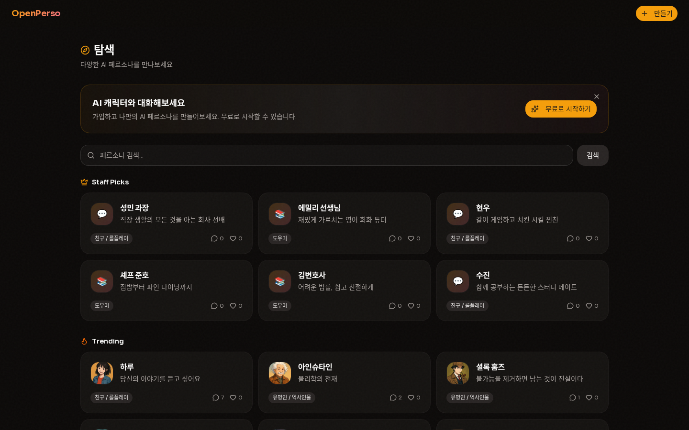
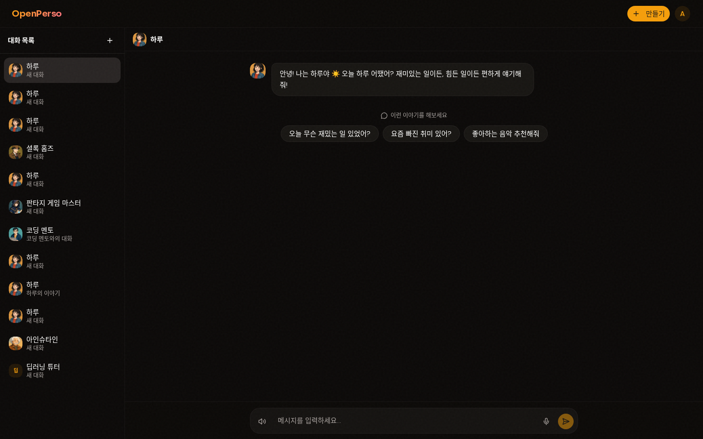

<div align="center">

# 🎭 OpenPerso

### Open-source AI Character Chat Platform

**누구나 AI 캐릭터를 만들고, 대화하고, 공유하는 오픈소스 플랫폼**

[](https://opensource.org/licenses/MIT)
[](https://www.python.org/)
[](https://nextjs.org/)
[](https://fastapi.tiangolo.com/)
[](https://www.postgresql.org/)

[한국어](#-openperso-1) | [English](#-overview) | [Quick Start](#-quick-start) | [Contributing](#-contributing)

</div>

---

<!-- 
  📸 Screenshots placeholder
  프로젝트 스크린샷을 docs/screenshots/ 폴더에 추가한 후 아래 주석을 해제하세요.
  
  <div align="center">
    
    <br /><br />
    
  </div>
-->

## 📖 Overview

OpenPerso is a self-hostable, open-source alternative to Character.AI. Build your own AI character platform with full control over your data, models, and user experience.

### Why OpenPerso?

- **🔓 Open Source** — Full transparency. Self-host on your own infrastructure.
- **🤖 Model Agnostic** — Works with any OpenAI-compatible API (OpenAI, Claude, local LLMs via Ollama, etc.)
- **🧠 Memory System** — Characters remember past conversations with hybrid global + per-character memory.
- **🎨 One-Click Creation** — Generate a complete character from just a name and description.
- **🌐 Shareable** — Create characters and share them with the community.
- **📱 Mobile Ready** — PWA support for mobile home screen installation.

---

## ✨ Features

<table>
<tr>
<td width="50%">

### 💬 Intelligent Chat
- Real-time SSE streaming responses
- In-chat image generation
- Conversation starters per character
- Short-term memory with auto-summarization (20+ turns)

</td>
<td width="50%">

### 🎭 Character Creation
- AI-powered one-click character generation
- AI avatar generation (DALL·E / gpt-image)
- Personality sliders (warmth, humor, formality, etc.)
- Category system (celebrities, K-content, games, helpers, friends, healing)

</td>
</tr>
<tr>
<td width="50%">

### 🧠 Memory System
- **Global Memory**: Rule-based, real-time extraction (name, preferences, facts)
- **Per-Character Memory**: LLM-based, async extraction (relationship, context)
- Vector embeddings via pgvector for semantic recall

</td>
<td width="50%">

### 🔊 Voice & Multimodal
- Text-to-Speech via OpenAI TTS API
- Multiple voice options per character
- Speech-to-Text via Web Speech API
- Image generation during conversations

</td>
</tr>
<tr>
<td width="50%">

### 🔍 Explore & Discover
- Staff Picks / Trending / Newly Created sections
- Category-based filtering
- Search with keyword matching
- Chat count display on character cards

</td>
<td width="50%">

### 🛡️ Production Ready
- JWT authentication (email/password + Google OAuth)
- API rate limiting with Redis
- Guest trial (3 turns without sign-up)
- Account deletion with CASCADE cleanup
- Privacy policy & Terms of Service pages

</td>
</tr>
</table>

---

## 🏗️ Architecture

```
┌─────────────────────────────────────────────────────────┐
│                  Frontend (Next.js 16)                   │
│                                                         │
│  Landing ─ Explore ─ Create ─ Chat ─ Profile ─ Pricing  │
└──────────────────────┬──────────────────────────────────┘
                       │ HTTP / SSE
              ┌────────▼────────┐
              │  FastAPI Backend │
              │                 │
              │  Auth ─ Chat    │
              │  Persona ─ LLM  │
              │  Memory ─ TTS   │
              │  Image ─ Admin  │
              └──┬──────┬──────┬┘
                 │      │      │
     ┌───────────┘      │      └───────────┐
     │                  │                  │
┌────▼─────┐    ┌───────▼───────┐   ┌──────▼──────┐
│PostgreSQL │    │     Redis     │   │    MinIO     │
│+ pgvector │    │  Cache/Queue  │   │  S3 Storage  │
└──────────┘    └───────────────┘   └─────────────┘
```

---

## 🛠️ Tech Stack

| Layer | Technology |
|-------|-----------|
| **Frontend** | Next.js 16 (App Router), TypeScript, Tailwind CSS, shadcn/ui |
| **Backend** | FastAPI, Python 3.12, SQLAlchemy 2.0 (async), Alembic |
| **Database** | PostgreSQL 16 + pgvector |
| **Cache** | Redis |
| **Storage** | MinIO (S3-compatible) |
| **LLM** | Any OpenAI-compatible API |
| **TTS** | OpenAI TTS API |
| **Auth** | JWT + Google OAuth |
| **Infra** | Docker Compose (dev) → Kubernetes (prod) |

---

## 🚀 Quick Start

### Prerequisites

- **Docker & Docker Compose** (for PostgreSQL, Redis, MinIO)
- **Node.js 20+** and npm
- **Python 3.12+**
- **[uv](https://docs.astral.sh/uv/)** (recommended Python package manager)
- **OpenAI API Key** (or any OpenAI-compatible API)

### 1. Clone & Configure

```bash
git clone https://github.com/Daewooki/OpenPerso.git
cd OpenPerso

# Copy environment template
cp .env.example .env
```

Edit `.env` and fill in your API keys:

```env
# Required: Your LLM API key
LLM_API_KEY=sk-your-openai-api-key
LLM_SUB_API_KEY=sk-your-openai-api-key

# Change in production!
SECRET_KEY=your-secret-key-here
POSTGRES_PASSWORD=your-secure-password
```

### 2. Start Infrastructure

```bash
docker-compose up -d
```

This starts PostgreSQL (port 5434), Redis (port 6381), and MinIO (port 9200).

### 3. Start Backend

```bash
cd backend

# Install dependencies
uv sync

# Run database migrations
PYTHONPATH=. uv run alembic upgrade head

# Start the server
PYTHONPATH=. .venv/bin/uvicorn app.main:app --reload --port 8200
```

An admin account is auto-created on first startup (configure via `ADMIN_EMAIL` and `ADMIN_PASSWORD` in `.env`).

### 4. Start Frontend

```bash
cd frontend

# Install dependencies
npm install

# Start dev server
npm run dev -- -p 3200
```

### 5. Open

Visit **http://localhost:3200** and start creating AI characters!

### 6. (Optional) Seed Characters

```bash
cd backend
PYTHONPATH=. .venv/bin/python scripts/seed_personas.py
```

This adds 6 sample characters (Einstein, Sherlock Holmes, Coding Mentor, etc.)

---

## 📁 Project Structure

```
openperso/
├── backend/
│   ├── app/
│   │   ├── api/v1/          # REST API endpoints
│   │   │   ├── auth.py      # Login, register, JWT
│   │   │   ├── chat.py      # SSE streaming chat
│   │   │   ├── personas.py  # CRUD + generation
│   │   │   ├── explore.py   # Featured, trending, new
│   │   │   ├── guest.py     # Guest trial (3 turns)
│   │   │   ├── voice.py     # TTS endpoints
│   │   │   └── ...
│   │   ├── models/           # SQLAlchemy ORM models
│   │   ├── schemas/          # Pydantic validation
│   │   ├── services/         # Business logic
│   │   │   ├── chat.py       # Chat + streaming
│   │   │   ├── llm.py        # LLM abstraction layer
│   │   │   ├── memory.py     # Memory extraction
│   │   │   ├── persona_gen.py # AI character generation
│   │   │   ├── image_gen.py  # Image generation
│   │   │   ├── tts.py        # Text-to-speech
│   │   │   └── ...
│   │   └── workers/          # Background tasks
│   ├── alembic/              # DB migrations
│   └── scripts/              # Seed data, utilities
├── frontend/
│   └── src/
│       ├── app/              # Next.js pages (App Router)
│       │   ├── (auth)/       # Login, Register
│       │   ├── (main)/       # Explore, Chat, Create, Profile
│       │   └── trial/        # Guest trial
│       ├── components/       # Reusable React components
│       ├── hooks/            # Custom React hooks
│       ├── lib/              # API client, utilities
│       └── types/            # TypeScript definitions
├── nginx/                    # Reverse proxy config
├── docker-compose.yml        # Dev infrastructure
├── docker-compose.prod.yml   # Production deployment
└── docs/                     # Planning documents
```

---

## 🔧 Configuration

### Environment Variables

All configuration is done via `.env` file. See [`.env.example`](.env.example) for the full list.

| Variable | Description | Required |
|----------|-------------|----------|
| `LLM_API_KEY` | OpenAI (or compatible) API key | ✅ |
| `LLM_MODEL` | Main chat model (default: `gpt-4o`) | |
| `LLM_SUB_API_KEY` | API key for auxiliary tasks | ✅ |
| `LLM_SUB_MODEL` | Auxiliary model (default: `gpt-4o-mini`) | |
| `SECRET_KEY` | JWT signing secret | ✅ prod |
| `POSTGRES_PASSWORD` | Database password | ✅ prod |
| `ADMIN_EMAIL` | Auto-created admin email | |
| `ADMIN_PASSWORD` | Auto-created admin password | |
| `GOOGLE_CLIENT_ID` | Google OAuth client ID | |
| `GOOGLE_CLIENT_SECRET` | Google OAuth client secret | |

### Using Different LLM Providers

OpenPerso works with any OpenAI-compatible API:

```env
# OpenAI (default)
LLM_API_URL=https://api.openai.com/v1
LLM_MODEL=gpt-4o

# Ollama (local)
LLM_API_URL=http://localhost:11434/v1
LLM_MODEL=llama3

# Any OpenAI-compatible provider
LLM_API_URL=https://your-provider.com/v1
LLM_MODEL=your-model-name
```

---

## 🗺️ Roadmap

- [x] Text chat with SSE streaming
- [x] AI character generation (one-click)
- [x] Memory system (global + per-character)
- [x] AI avatar generation
- [x] In-chat image generation
- [x] Voice output (TTS)
- [x] Guest trial mode
- [x] Explore page (featured, trending, new)
- [x] PWA support
- [x] SEO (sitemap, OG tags)
- [ ] Voice input (real-time STT)
- [ ] Voice chat mode (bidirectional)
- [ ] Avatar animation (lip-sync)
- [ ] Group chat (multiple characters)
- [ ] Character marketplace
- [ ] Creator analytics dashboard
- [ ] Plugin system
- [ ] Multi-language support (i18n)

---

## 🤝 Contributing

Contributions are welcome! See [CONTRIBUTING.md](CONTRIBUTING.md) for guidelines.

```bash
# Fork → Clone → Branch → Code → PR
git checkout -b feature/amazing-feature
git commit -m 'feat: add amazing feature'
git push origin feature/amazing-feature
```

---

## 📄 License

This project is licensed under the [MIT License](LICENSE).

---

## 🙏 Acknowledgments

- [FastAPI](https://fastapi.tiangolo.com/) — Modern Python web framework
- [Next.js](https://nextjs.org/) — React framework
- [shadcn/ui](https://ui.shadcn.com/) — UI component library
- [OpenAI API](https://platform.openai.com/) — LLM, TTS, and image generation

---

<div align="center">

**⭐ Star this repo if you find it useful!**

Made with ❤️ by [Daewooki](https://github.com/Daewooki)

</div>
